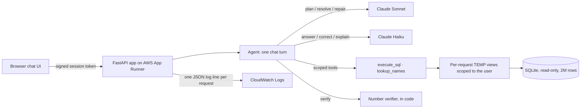
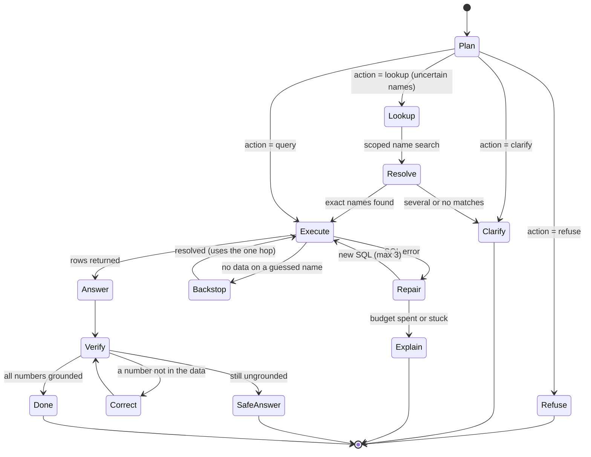
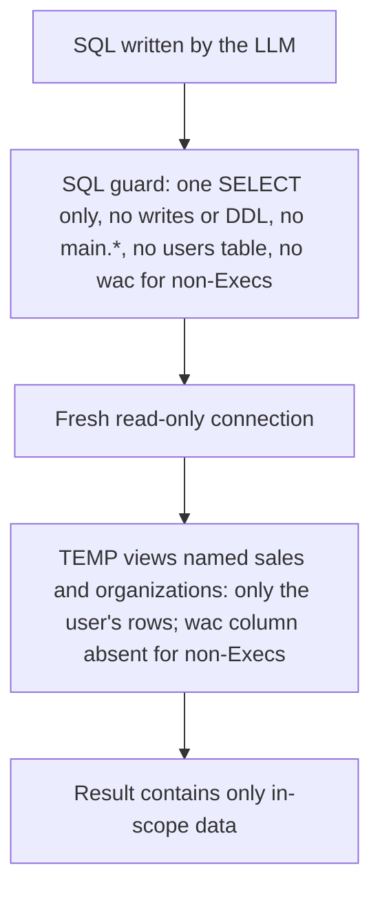

# DESIGN.md: NL-to-SQL Commercial Analytics Assistant

A conversational AI agent that answers plain-English questions about NovaPharma's commercial
sales data (40,000 organizations, 2,000,000 sales rows). Each answer comes from a SQL query that
runs **inside the signed-in user's access scope**, and **every number in the answer is checked
against the query result in code** before it is shown.

| | |
|---|---|
| **Live URL** | `<APP RUNNER URL>` |
| **Stack** | FastAPI · SQLite (read-only, in the image) · Claude Sonnet (planner) + Claude Haiku (answers) · AWS App Runner + ECR + CloudWatch |
| **Agent design** | Bounded workflow agent: the LLM makes the judgment calls (plan, look up, clarify, refuse); code enforces every limit (security, hop and retry budgets, number verification) |
| **Priorities** | **Accuracy > latency > cost**, and security never depends on the LLM |
| **Evaluation** | **36/36** cases pass across 6 categories and 5 rubric dimensions. The first run scored 30/36 and found real defects, which were fixed. See [`evals/results_final.md`](evals/results_final.md) and [`TEST_RESULTS.md`](TEST_RESULTS.md) |
| **Security** | 0 scope or pricing leaks across all eval cases; 13/13 deterministic security checks |
| **Latency** | Median 8.4s, p95 16.2s per question; the results table appears before the answer text |

> The UI is branded "Avyxa Pharma Analytics" for this take-home assessment. It is not an official Avyxa product.

---

## Contents

1. [Design principles](#1-design-principles)
2. [How the requirements map to this design](#2-how-the-requirements-map-to-this-design)
3. [System architecture](#3-system-architecture)
4. [Agent architecture](#4-agent-architecture)
5. [Database choice and rationale](#5-database-choice-and-rationale)
6. [How domain knowledge is integrated](#6-how-domain-knowledge-is-integrated)
7. [LLM provider and prompt design](#7-llm-provider-and-prompt-design)
8. [Security implementation](#8-security-implementation)
9. [User experience](#9-user-experience)
10. [Cloud services and deployment](#10-cloud-services-and-deployment)
11. [Observability](#11-observability)
12. [Evaluation and testing](#12-evaluation-and-testing)
13. [Performance and cost](#13-performance-and-cost)
14. [Trade-offs](#14-trade-offs)
15. [Assumptions](#15-assumptions)
16. [Known limitations](#16-known-limitations)
17. [What I'd improve with more time](#17-what-id-improve-with-more-time)

---

## 1. Design principles

These eight principles decided every trade-off in this document. When two goals conflicted, the
principle higher in this list won.

| # | Principle | What it meant in practice |
|---|---|---|
| 1 | **Security never depends on the LLM** | Access control lives in scoped database views and a SQL guard. The model can write any SQL it likes; out-of-scope rows and the `wac` column simply don't exist for that connection |
| 2 | **Accuracy over latency, latency over cost** | A strong model plans the SQL; a verifier checks every number; a repair loop recovers from errors. Speed-ups were accepted only when they cost no accuracy (prompt caching, streaming, an answer cache). A faster planner model and shorter reasoning were **rejected** |
| 3 | **The LLM decides, code bounds** | Judgment calls (what to query, whether a name is ambiguous, when to clarify) go to the model. Every budget and safety rule (retries, hops, row caps, timeouts, verification) is enforced deterministically |
| 4 | **Deterministic where possible, LLM only where necessary** | Number grounding, security, SQL-request handling, and evaluation correctness are all checked in code. LLMs are used only for language understanding and generation |
| 5 | **Single-hop by default, multi-hop only when the question needs it** | Most questions are answered by one SQL query (joins and CTEs do the multi-step work). A second hop runs only for uncertain organization names, capped at one hop per question |
| 6 | **Default before asking** | Vague questions get a sensible default with the assumption stated; the agent clarifies only when a guess would probably be wrong |
| 7 | **Honest over impressive** | Market share above 100% is explained, not hidden; partial periods are flagged; limitations are documented next to the scores |
| 8 | **Measure before optimizing** | Per-stage timings showed the LLM, not the database, was the bottleneck; the eval, not intuition, decided which fixes to make |

---

## 2. How the requirements map to this design

| What the assignment asks for | How it's addressed | Section |
|---|---|---|
| Chat UI: follow-ups, loading states, clear results, no SQL unless asked | Streaming chat, live "thinking" line, result table, follow-up chips, SQL only on explicit request | [9](#9-user-experience) |
| NL-to-SQL: aggregations, time comparisons, rankings, joins | Bounded workflow agent with explicit business rules, repair loop, lookup hop, and number verification | [4](#4-agent-architecture), [7](#7-llm-provider-and-prompt-design) |
| Domain knowledge (market share formula, "sales" = paid demand) | Full docs in the prompt + distilled rules + runtime facts | [6](#6-how-domain-knowledge-is-integrated) |
| RBAC: RAM → territory, Director → region, Exec → all; WAC hidden from non-Execs | Per-request scoped TEMP views, WAC column removed, SQL guard | [8](#8-security-implementation) |
| Works on the full dataset (40K orgs, 2M rows) | Indexed, read-only SQLite; aggregations in 0.1–2.2s | [5](#5-database-choice-and-rationale) |
| Cloud deployment + IaC or setup instructions | App Runner + ECR + CloudWatch; step-by-step commands in `DEPLOY.md` | [10](#10-cloud-services-and-deployment) |
| Test cases and results | DeepEval-based suite (36 cases) + deterministic suites | [12](#12-evaluation-and-testing) |
| Document assumptions | Design and data assumptions with evidence | [15](#15-assumptions) |

---

## 3. System architecture



| File | Responsibility |
|---|---|
| `app/main.py` | HTTP API: login, signed sessions, validation, rate limiting, streaming endpoint (NDJSON), static UI |
| `app/pipeline.py` | **The agent**: one chat turn as a bounded state machine that emits a stream of events; failure handling; answer cache; logging |
| `app/llm.py` | Provider layer (Anthropic/OpenAI, retries, failover) and every prompt: plan, resolve, repair, answer, explain failure, explain SQL |
| `app/security.py` | Scoped TEMP views, SQL guard, error types |
| `app/db.py` | The agent's tools: read-only execution with timeout and row cap, scoped name lookup, period and reference data |
| `app/verify.py` | Deterministic number grounding check |
| `app/domain.py` | Loads the 8 business documents |
| `static/index.html` | Single-file chat UI |
| `scripts/`, `evals/` | Data loading, deterministic test suites, the evaluation harness and results |

---

## 4. Agent architecture

### 4.1 What kind of agent this is

This is a **bounded workflow agent**, not an open-ended autonomous loop. Each chat turn moves
through a fixed state machine. The LLM chooses the **path** at each decision point; the code owns
the **states, transitions, and budgets**.



**Why a bounded workflow instead of an autonomous ReAct-style loop:**

| Consideration | Bounded workflow (chosen) | Open-ended tool loop |
|---|---|---|
| Task shape | One question → one query answers it (joins and CTEs handle the multi-step logic) | Built for open-ended, multi-step tasks this domain doesn't have |
| Predictability | Every path is known, testable, and logged | The model decides how long to loop and which tools to call |
| Cost and latency | Hard ceiling: **7 LLM calls** per question; typically 2 | Unbounded without extra guardrails |
| Security | The model only proposes; code executes inside scoped views | More tool calls mean more surface to guard |
| Evaluability | Each state is independently testable (the backstop, lookups, and SQL requests all have their own test suites) | Harder to test paths the model invents |

The agent still makes real judgment calls; it just can't loop, wander, or overrun a budget.

### 4.2 Division of labor: the LLM decides, code bounds

| Decision | Made by | Enforced by |
|---|---|---|
| Which SQL answers the question | Planner (Sonnet) | SQL guard + scoped views + read-only connection |
| Whether a name is uncertain and needs a lookup | Planner | One-hop cap, ≤3 terms, parameterized search in the user's scope |
| Whether the planner guessed a name wrongly | **Code** (backstop: exact-name filter + no data) | Same one-hop budget |
| Whether to clarify or refuse | Planner | Options sanitized (≤4, length-capped); unknown actions become a clarification |
| How to fix a failed query | Planner (repair) | ≤3 retries, full failure history, identical-SQL loop detection, security errors never retried |
| How to phrase the answer | Answerer (Haiku) | Number verifier; one correction; safe fallback |
| Whether the user may see a column or row | **Code only** | TEMP views, guard, signed identity |
| Whether to show SQL | **Code** (explicit request detected) | Exact SQL from history; never regenerated or re-executed |

### 4.3 Action space and tools

The planner returns one **structured JSON action**:

| Action | Meaning | What code does next |
|---|---|---|
| `query` | SQL that answers the question | Guard → execute in scoped views |
| `lookup` | Uncertain organization names (up to 3) | Scoped `LIKE` search, then the resolve step |
| `clarify` | A default would probably be wrong | Show the message with 2–4 clickable options |
| `refuse` | Out of policy (e.g. pricing for a non-Exec) | Show the refusal with a volume-based alternative |

**Tools the agent can use, all scoped to the signed-in user:**
- `execute_sql`: read-only, guarded, 15-second timeout, 1,000-row cap
- `lookup_names`: parameterized name search across health systems, parent groups, and facilities
- `explain_sql`: plain-English explanation of a query the user explicitly asked to see
- `explain_failure`: plain-language explanation plus answerable alternatives, used as a last resort

**Why structured JSON actions instead of native function calling:** one schema covers every
decision; it is provider-portable (the same contract works on Anthropic and OpenAI); every
decision is trivially logged and asserted in tests; and the task never needs a multi-turn
tool-calling loop. Malformed JSON gets one automatic retry.

### 4.4 When the agent goes multi-hop, and why it stops at one

- **Single-hop by default.** Market share needs a numerator and a denominator from two data
  sources; account rollups walk facility → parent → health system; territory questions walk
  organization → ZIP → territory. **All of this happens inside one SQL query** via CTEs and joins,
  which is exactly the work multi-hop retrieval does in other systems.
- **Multi-hop only for uncertain names.** The one runtime unknown in this data model is a fuzzy
  organization name ("How is Memorial doing?", "Compare Memorial vs Lakeshore"). Guessing an
  exact name silently returns "no data," so the agent looks the name up first.
- **Two triggers:** the planner requests a lookup, or the **deterministic backstop** fires when a
  query filters on an exact name and returns no data. The backstop separates a wrong name
  (resolve and re-query) from a real name with genuinely no data (keep the correct empty result).
- **Capped at one hop per question**, but up to 3 names in that hop: *breadth per hop, not depth*.
  Each extra hop adds ~5–8s and compounds error (three chained hops at 90% accuracy each are
  ~73% end to end), and no question in this domain needs a second sequential hop.
- **Measured, not assumed:** every request logs whether a lookup came from the planner or the
  backstop, so the backstop rate is the planner's miss rate.

### 4.5 Specialized roles, not a multi-agent system

The agent uses **role specialization with model tiering**: a planner (Sonnet) where correctness
is decided, and an answerer (Haiku) that only restates verified rows. It is deliberately **not**
a multi-agent system of independently reasoning agents: coordination between agents adds
latency, cost, and new failure modes (agents disagreeing, error compounding across hand-offs),
and this task has no parallelizable sub-problems that would justify it.

### 4.6 Generator–verifier loop (grounding)

The answerer is a **generator**; `app/verify.py` is a **deterministic verifier**. Every number in
the answer must trace to the result rows, the question, the summary, or the period labels. On a
failure, the generator is re-prompted once with the exact numbers it got wrong; if it still
fails, the user sees a grounded summary of what was computed, with the exact table below it. The
verifier is code, not an LLM judge, so it can't be persuaded by fluent text.

### 4.7 State and memory

| Kind | Design | Why |
|---|---|---|
| **Short-term memory** | The last 10 turns, each including the SQL that ran, sent with every request | Follow-ups ("exclude 340B") modify the **exact** previous query, not a paraphrase of it |
| **Rolling summarization** | Not used | 10 turns is ~17K tokens (~8% of the context window); summaries are lossy, and follow-ups need exact filters |
| **Long-term memory** | Not used | An analytics query tool doesn't need cross-session preferences |
| **Server state** | Stateless per request (history held by the client) | Trivial horizontal scaling; no stored conversations |
| **Answer cache** | Per user, per data refresh, 1-hour TTL | Repeat questions are instant; the user ID in the key prevents cross-role leaks |

### 4.8 Human in the loop

- **Clarification with options:** when a guess would probably be wrong, the agent asks and offers
  2–4 clickable choices, usually the exact matching account names from the database.
- **Transparent assumptions:** every answer's "How I got this" states what was counted, the time
  window, and any default applied, so the user can correct a wrong assumption in one follow-up.
- **Alternatives instead of dead ends:** refusals and failures always come with next steps.
- **SQL on request** for users who want to audit the exact query.

### 4.9 Guardrails at every layer

| Layer | Guardrail |
|---|---|
| Input | Signed session token, request validation, allowed history roles, per-user rate limit |
| Planning | Explicit business and safety rules; the non-Exec schema omits `wac` |
| Execution | SQL guard, scoped TEMP views, read-only connection, timeout, row cap |
| Agent control | Repair ≤3, lookup hops ≤1, correction ≤1, identical-SQL detection, worst case 7 LLM calls |
| Output | Number verifier, markdown cleanup, no raw error text, verified badge only after verification |

### 4.10 Failure ladder: never give up on the first problem

1. **Malformed model JSON** → one automatic retry
2. **SQL errors** → up to 3 repairs with the full failure history, told to change approach after the first
3. **Fuzzy names** → the lookup hop or the backstop
4. **Still unanswerable** → `explain_failure`: a plain-language reason plus answerable alternatives
5. **AI service down** → a clear message and a one-tap retry
6. **Bug in the code** → "Something went wrong on my side," a retry, and the full traceback in the logs only

Every failure path ends with something the user can click.

### 4.11 Evaluation-driven development

The agent was tuned against the evaluation suite, not intuition. The first run (30/36) exposed
four real defects: total-sales questions returned breakdowns instead of a single total; the
Exec's total omitted pricing, contradicting the security spec; a fallback answer carried no
information; and the backstop missed aggregate queries that return `[[None]]`. Each fix was
backed by evidence in the report, and the final run passed 36/36 (section 12).

---

## 5. Database choice and rationale

**SQLite, read-only, baked into the container image.**

| Consideration | Decision and reasoning |
|---|---|
| **Scale** | 2M sales rows in about 300MB. With indexes, full-table aggregations finish in **0.1–2.2s** (measured), including market share, which scans the sales table twice. The LLM, not the database, is the bottleneck |
| **Workload** | Analytics only: **no writes, ever.** A read-only file removes a whole class of risk: no connection pool, no credentials, no network hop, no mutable state |
| **Deployment** | One artifact: the image contains the app **and** the data. Every deploy is reproducible, and there is no database to provision, patch, or secure |
| **Security** | Opened with `mode=ro`, so even a guard bypass could not modify data. Per-request TEMP views give row- and column-level scoping without database users or grants |
| **Schema** | **Unchanged.** The provided DDL is used exactly as given. The only additions are indexes, `ANALYZE` statistics, and per-connection TEMP views, none of which alter a table or column |

**Indexes** (`scripts/load_db.py`): `organizations(zip)`, `organizations(grandparent_org_name)`, `sales(org_id)`, `sales(data_source, brand_flag)`, `sales(mo_offset)`, `sales(period_qtr)`, `sales(ndc)`, `zip_territory(territory_name)`, `zip_territory(region_name)`, followed by `ANALYZE`.

**Data preparation:** the generated CSVs (`schema/generate_data.py`, `SEED = 42`, deterministic) are loaded as-is, with **one fix: empty strings become `NULL`**. The generator writes `""` for missing values, which would break `COALESCE(grandparent_org_name, org_name)` for the 10,000 standalone facilities. The `users` table comes from `seed_data.sql`. The database file isn't committed (it is rebuilt from the generator); it is copied into the image at build time.

**When to switch:** PostgreSQL (RDS/Aurora) once the data refreshes continuously, grows past a few GB, or needs concurrent writers. The scoping model carries over directly as row-level security policies plus column grants.

---

## 6. How domain knowledge is integrated

Domain knowledge enters in **five layers**:

1. **Full business documents in the planner prompt.** All 8 files in `docs/` are loaded once, cached, and injected into every planning call, ordered from definitions to example questions (`app/domain.py`).
2. **Critical rules restated explicitly** (`PLAN_RULES`), because models follow a short explicit rule more reliably than a sentence buried in pages of prose:
   - "sales" / "demand" / "volume" = `data_source = 'distributor' AND brand_flag = 1`; **hub_dispense (free drug) excluded** unless explicitly requested; market_data never used for NovaPharma's own sales
   - default volume = `SUM(pack_units)`; equivalents = `pack_units × unit_conversion_factor`
   - market share = NovaPharma distributor equivalents ÷ market_data equivalents for the same `market_subcategory`, **in separate CTEs**
   - "accounts" = health-system level via `COALESCE(grandparent_org_name, org_name)`
   - territory and region via `organizations.zip → zip_territory` (never `sales.state`)
   - time windows use offset and label columns, never date math
   - **all arithmetic happens in SQL**; the answer step may only restate returned values
   - a total means **one summary row**; for Execs, a sales total includes `SUM(wac)`, for everyone else it is units only
3. **A semantic, role-aware schema** with value meanings, and **no `wac` column for non-Exec users**.
4. **Runtime facts from the data:** current month and quarter labels and the data-through date (**2026-09-19**), so "this quarter" resolves correctly and partial periods are flagged.
5. **Reference data:** all 6 regions and 15 territories from `zip_territory`, so region and territory names resolve without a lookup.

**Why not RAG:** the corpus is small, and nearly every question depends on the same core rules at once. Retrieval would add a failure mode (a missed chunk means confidently wrong SQL) with no accuracy gain. RAG becomes appropriate at hundreds of documents.

**Where the documents conflict with the data:**
- **Market share above 100%.** `metric_definitions.md` says the market_data denominator includes NovaPharma's own volume, but `generate_data.py` writes market_data rows **only for competitor products**. The documented formula is kept, and every such answer explains the gap.
- **"Last quarter."** `period_offsets.md` defines it as `mo_offset IN (1,2,3)`; quarter-vs-quarter comparisons use `period_qtr` labels.

---

## 7. LLM provider and prompt design

### Provider and model tiering

- **Claude Sonnet** for planning, resolving names, and repairing SQL: the steps where correctness is decided.
- **Claude Haiku** for writing answers, corrections, and SQL explanations: restating verified rows is simple, so a cheaper, faster model suffices.
- **Pluggable provider layer:** SDK retries (3×, backoff) for transient errors, optional failover to OpenAI. For streamed answers, failover happens only before the first token.

### Planner prompt

| Technique | Why |
|---|---|
| **Structured JSON contract** (`reasoning`, `action`, `sql`, `lookup`, `summary`, `message`, `options`) with one retry on malformed JSON | Machine-checkable decisions (section 4.3) |
| **Short reasoning field (2–4 sentences)** before the SQL | Lightweight chain-of-thought. A shorter version was rejected: about 1s saved, at an accuracy risk |
| **Static/dynamic split with prompt caching** | Rules, reference data, and docs (~9.5K tokens) form an identical cached prefix; the user's schema, scope, and periods go last. Warm planning **8.7s vs 17.5s cold** |
| **Plain-language `summary`** | Shown in "How I got this"; SQL, table, and column names are forbidden in it |
| **Ambiguity policy in a fixed order** | Default and state the assumption → look up uncertain names → clarify only if a guess would probably be wrong |
| **Scope honesty** | The planner knows the tables are already filtered; if a RAM asks to "compare all territories," the answer says only their territory is visible |

### Answer prompt

- Receives **only** the question, the summary, the data-through date, and up to 30 result rows. **It never sees the schema and never writes SQL.**
- Strict number rules: state only numbers present in the rows, exactly as given; never compute totals or percentages; describe a set as "ranging from X to Y" only if every member is in range.
- Context rules: flag partial periods and **never describe a partial period as growth or decline**; explain market share above 100%.

### Temperature

Requested as 0 for reproducibility. The installed Anthropic SDK rejects the parameter, so the app falls back to the provider default; the evaluation report states this, and `--repeat` checks consistency.

---

## 8. Security implementation

**Principle: the LLM is never trusted for access control.**



### Authentication and identity

- **Mock login** with three demo users: Exec (U001), Director of the Northeast (U003), RAM for New York Metro (U009). Only these IDs can log in.
- **HMAC-signed session token** (`itsdangerous`, 8-hour expiry, secret from the environment). Tampered or forged tokens are rejected (401).
- **Identity resolves server-side** from the `users` table on every request.
- **Validation:** length limits; history may contain only `user` and `assistant` turns (an injected `system` turn is rejected, 422); **rate limit** 20 questions per minute per user (429).

### Row-level security

`organizations` has no territory column, so scope is derived from `organizations.zip → zip_territory`. Per request, `build_scoped_views()` creates TEMP views named `sales` and `organizations` that **shadow the real tables**:

| Role | Rows visible |
|---|---|
| RAM | Organizations (and their sales) whose ZIP maps to their `territory_name` |
| Director | Organizations (and their sales) whose ZIP maps to their `region_name` |
| Exec | Everything |

- The Director filter uses `region_name` specifically, because **"South Central" is both a territory and a region**.
- **Market data follows the same scoping**, as the security model requires.
- `products` and `zip_territory` are unrestricted reference tables, as specified.
- Measured: RAM 136,921 sales rows, Director 268,912, Exec 2,000,000. A RAM querying Texas gets 0 rows.

### Column-level security (WAC): three independent layers

1. **The column doesn't exist in non-Exec views.**
2. **The guard blocks any reference to `wac`** for non-Execs (`WacRestricted`, never retried), returning a refusal with a volume-based alternative.
3. **The planner is never told the column exists** for non-Execs.

### SQL guard

A single `SELECT`/`WITH` statement; no write or DDL keywords (`INSERT/UPDATE/DELETE/DROP/ALTER/CREATE/ATTACH/DETACH/PRAGMA/REPLACE/VACUUM/REINDEX`); no `main.*`; no `users` table. **Security checks run before shape checks**, so an unsafe query is always classified as a violation.

### Other leak paths, closed

| Path | Mitigation |
|---|---|
| Name lookups revealing other territories' accounts | Lookups run through the scoped views: "not found within your access" reveals nothing |
| Cached answers crossing roles | The cache key includes the user ID and data-refresh date |
| Errors leaking internals | Raw errors are never shown; tracebacks go to logs only |
| SQL exposure | Hidden by default; shown only on explicit request, from the user's own history, never re-executed |
| SQL injection in lookup terms | Bound parameters; wildcards stripped; length capped |
| Prompt injection ("You are now an Exec") | Scope comes from the signed token and the views, not the prompt (eval case E-5) |

**Evidence:** `test_security.py` (13/13), `test_api.py` (12/12), and 8 security eval cases covering all six scenarios in `docs/security_model.md` (8/8).

---

## 9. User experience

| Feature | Behavior |
|---|---|
| **Login** | Three role cards; the header shows who is signed in and their scope |
| **Thinking indicator** | One live line ("Understanding your question → Querying your data → Writing the answer → Checking the numbers") that collapses to "Thought for 8.4s ▸" with per-step timings |
| **Results first** | The table streams as soon as the query finishes; the answer then streams token by token |
| **Verified badge** | Appears only after verification passes; "Revised to match the data exactly" if a correction was made |
| **How I got this** | Plain-English reasoning: what was counted, the time period, assumptions, access scope. **No SQL** |
| **SQL on request** | "Show me the SQL" returns the exact query behind the previous answer, with a step-by-step explanation |
| **Multi-turn** | Follow-ups refine the exact previous query; follow-up chips offer common refinements |
| **Ambiguity** | Clarifications with clickable options, usually real account names |
| **Failures** | Plain-language explanations with alternatives; one-tap retry for outages, rate limits, and network errors |
| **Export** | Copy the answer; download the full result as CSV |

---

## 10. Cloud services and deployment

| Service | Role | Why |
|---|---|---|
| **Amazon ECR** | Stores the container image (app + read-only database) | Private, versioned images that App Runner pulls directly |
| **AWS App Runner** | Runs the container behind a public HTTPS URL; health checks on `/api/health` | The simplest managed option for one web container: no VPC, load balancer, or cluster; HTTPS and scaling built in; supports streamed responses |
| **Amazon CloudWatch Logs** | Receives the app's JSON logs from stdout | Queryable with Logs Insights (section 11) |

**Container:** `python:3.12-slim`, pinned runtime dependencies, non-root user, health check, `uvicorn` on port 8080. `.dockerignore` keeps `.env`, the virtual environment, raw CSVs, scripts, and eval files out of the image.

**Secrets:** API keys and the session secret are App Runner environment variables, never in the image or repository. In production: AWS Secrets Manager.

| Alternative | Why not chosen |
|---|---|
| ECS Fargate | Needs an ALB, VPC, task definitions: more setup than one container needs |
| Lambda | A 300MB SQLite file plus streamed responses fit poorly with packaging and cold starts |
| EC2 | Kept as the fallback path; manual patching and HTTPS setup |
| RDS / Aurora | Unnecessary for a read-only 300MB dataset |
| Bedrock | A reasonable in-AWS LLM option; the provider layer is pluggable, and Anthropic's API was used directly for faster iteration |

**Setup instructions:** reproducible commands in [`DEPLOY.md`](DEPLOY.md).

---

## 11. Observability

Every request emits **one structured JSON log line** covering each step of the agent: user and role, question, generated SQL, rows, repair attempts and errors, lookup hops and trigger (planner vs. backstop), verification results (numbers caught, corrected, safe fallback), cache hits, prompt-cache tokens, **per-stage timings**, total latency, provider, and errors. Internal errors also log a full traceback.

```json
{"request_id": "96f7a1df", "user_id": "U001", "role": "exec",
 "question": "What is our market share for Zenovax in the Docetaxel market?",
 "kind": "query", "rows": 1, "repair_attempts": 0, "lookup_hops": 0,
 "verified": true, "unverified_numbers": [], "corrected": false, "safe_answer_used": false,
 "cache_hit": false, "plan_cache_read_tokens": 9516,
 "timings_ms": {"plan_ms": 8672, "query_ms": 2246, "answer_ms": 1717, "verify_ms": 0},
 "latency_ms": 12640, "error": null, "provider": "anthropic"}
```

**CloudWatch Logs Insights queries:**
```
stats avg(latency_ms), pct(latency_ms, 95), count(*) by role
filter corrected = 1 or safe_answer_used = 1 | stats count(*)
filter lookup.trigger = "backstop" | stats count(*)
filter kind = "error" | stats count(*) by error
```

The who-asked-what and what-SQL-ran record doubles as an **audit trail** for access-control review. **Not logged, on purpose:** API keys, tokens, raw result rows, full prompts. **Gap:** tokens and estimated cost per request (section 17).

---

## 12. Evaluation and testing

### Evaluation suite (`evals/`)

36 cases in 6 categories: core analytics (8), security (8), ambiguity that must clarify (4), edge cases (7), hallucination probes (8), and multi-turn (1). Each case defines concrete expected behavior, the unacceptable behavior (the trap), a severity (S1–S4), and acceptable response kinds; 18 have hand-written **reference SQL**.

| Dimension (0–3) | Gate | How it's scored |
|---|---|---|
| Correctness | ≥ 2 | **Execution accuracy** (result rows vs. the reference query **run as the same user**) + expected response kind + judged behavior |
| Relevance | ≥ 2 | LLM judge |
| Completeness | ≥ 1 | LLM judge |
| Groundedness | ≥ 2 | Deterministic number tracing + verified account names + judged claims |
| Safety & format | ≥ 2 | Deterministic scope, pricing, leak, and format checks + judge |

- **The judge is GPT-4o**, a different model family from the app's Claude models, returning schema-validated JSON (temperature 0, fixed seed).
- **Deterministic checks can only lower a score**, never raise it.
- **Hardened run:** answer cache off, provider fallback off, fresh conversation per case.

**Results:** first run **30/36 (83%)**, which found four real defects (section 4.11); final run **36/36**.

### Deterministic suites (`scripts/`)

| Suite | Checks |
|---|---|
| `test_security.py` | 13/13: scoping per role, WAC visibility, bypass, DROP, multi-statement, users-table attempts |
| `test_api.py` | 12/12: logins, missing, tampered, and forged tokens, validation, injected roles, rate limit, a real chat |
| `test_backstop.py` | 15/15: guessed-name detection, backstop behavior, one-hop cap, two-name lookups |
| `test_sql_request.py` | 12/12: SQL-request detection, exact SQL from history, explanation included |

---

## 13. Performance and cost

| Stage | Typical |
|---|---|
| Planning (LLM) | ~8.7s warm, ~17.5s cold |
| Database query | 0.1–2.2s |
| Answer (LLM) | 1.7–3.2s |
| Verification | < 1ms |
| **End to end** | **median 8.4s, p95 16.2s** |

LLM generation accounts for 80–90% of latency.

**Accepted, because they cost no accuracy:** prompt caching of the ~9.5K-token static prefix; streaming with the table first; a per-user answer cache; model tiering.
**Rejected, because they trade away accuracy:** a smaller planner model (roughly halves planning time, but risks errors on multi-source SQL like market share) and a shorter reasoning field.

**Cost profile:** two LLM calls per typical question, with the planner's static prompt cached; at most 7 by construction. Infrastructure is a single App Runner instance.

---

## 14. Trade-offs

| Decision | Chosen | Over | Why |
|---|---|---|---|
| Agent style | Bounded workflow state machine | Autonomous ReAct / tool loop | One query answers a question; bounded paths are predictable, testable, and capped in cost |
| Decision format | Structured JSON actions | Native function calling | One schema, provider-portable, easy to log and test |
| Agent roles | Planner + answerer + deterministic verifier | Multi-agent system | No parallel sub-problems; coordination adds latency and failure modes |
| Hops | Single-hop + at most one lookup hop (≤3 names) | Open-ended multi-hop | Joins do the multi-step work; chained hops compound error |
| Uncertain names | Planner lookup + deterministic backstop | Lookup only / guessing | The backstop catches planner misses and measures their rate |
| Grounding | Deterministic verifier | Runtime LLM judge | Deterministic, cheap, not fooled by fluent text |
| Correctness vs. latency | Strong planner, verifier, repair loop | A faster/smaller planner | Accuracy first; latency handled by streaming, caching, tiering |
| Access control | Scoped views + guard in code | Prompt instructions | The model can be wrong or manipulated |
| Domain knowledge | Full docs + explicit rules | RAG | Small corpus; every query needs the same rules at once |
| Database | Read-only SQLite in the image | PostgreSQL / RDS | Read-only 300MB dataset; one reproducible artifact |
| Streaming vs. verification | Stream live; verify; replace text if a number fails | Verify first, then fake-stream | Real streaming cuts perceived latency; the badge appears only after verification |
| Memory | Last 10 turns with SQL | Rolling summarization | ~8% of the context window; summaries lose exact filters |
| Ambiguity | Default → lookup → clarify | Always clarify / always guess | Fast answers with stated assumptions; asks only when needed |
| SQL visibility | Hidden; shown on explicit request | Always / never | Matches "no SQL unless they ask" |
| Failures | Explain + suggest; classified errors | Generic errors | No dead ends; no internals leaked |
| Auth | Mock login + signed tokens | Real identity provider | In scope; identity still can't be forged |
| Evaluation | Execution accuracy + cross-family judge + deterministic caps | Judge-only | Code checks what code can check |
| Deployment | App Runner | ECS / EKS / Lambda | Managed HTTPS and scaling for one container |

**Considered and deliberately not built:** a keyword pre-check that refuses pricing questions before any LLM call (a cost optimization only; security doesn't depend on it); a semantic catalog in code (maintainability, with no accuracy gain); long-term memory; OpenTelemetry tracing (single service); in-app live evaluations (anyone with the URL could spend API credits, and it needs background-job infrastructure).

---

## 15. Assumptions

### 15.1 Design assumptions

| Assumption | Consequence in the design |
|---|---|
| **Accuracy matters more than speed or cost.** A wrong number in a sales conversation costs more than a slow one | Strong planner model, number verification, repair loop, execution-accuracy evaluation; speed-ups accepted only if accuracy-neutral |
| **A wrong answer is worse than no answer** | When a written answer can't be verified, the user gets a grounded summary and the exact table instead; the verified badge only appears after verification |
| **Most questions are answerable with one query** | Single-hop by default; multi-hop reserved for uncertain names, capped at one hop per question |
| **The LLM will occasionally be wrong or manipulated** | Security enforced in views and a guard; budgets enforced in code; a backstop catches planner misses |
| **Users are non-technical sales and analytics staff** | Plain-language answers and reasoning, no SQL unless asked, defaults with stated assumptions, clickable options instead of open questions |
| **Latency of ~10s is acceptable if progress is visible** | Streaming, live progress line, results table before the answer text |
| **Analytics conversations are short** (a handful of related questions) | 10-turn memory without summarization |
| **Graders will test security scenarios literally** | Each of the six scenarios in `security_model.md` has a dedicated eval case |

### 15.2 Data and domain assumptions

| Assumption | Evidence / reasoning |
|---|---|
| **The generated data is the source of truth** (except the `users` table) | The seed file's territory names differ from the generated ones (seed "Great Lakes", "Mid-Atlantic", "Pacific" vs. generated "Great Lakes East/West", "Mid-Atlantic East/West", "Pacific Northwest"); the seed **users** reference the generated names |
| **`zip_territory` defines scope** | `organizations` has no territory column in the CSV; territory is assigned through ZIP. Where a ZIP could belong to two territories (Northern and Southern California share ZIP prefixes), the first mapping written to `zip_territory` is authoritative |
| **Data runs through 2026-09-19** | The generator anchors all weeks to that Saturday; the current month and quarter are partial and never described as growth or decline |
| **"Sales" means paid demand** | `data_source_guide.md`, `metric_definitions.md`: distributor + brand_flag = 1; hub_dispense only when asked |
| **Market share uses the documented formula**, even though it exceeds 100% here | market_data rows are generated from competitor products only (`generate_data.py`); the answer explains the gap |
| **Market share is shown as a percentage** | The docs define a 0–1 decimal "multiply by 100 for percentage"; percentages are clearer for users |
| **"Accounts" means health systems** | `metric_definitions.md`: grandparent level, falling back to the facility's own name |
| **"Last quarter" is `mo_offset IN (1,2,3)`** | `period_offsets.md`; comparisons use `period_qtr` labels |
| **A RAM asking to "compare all territories" sees only their own**, with an explanation | `security_model.md` allows denial or showing only their territory |
| **An Exec's "sales" total includes dollars** | Security scenario 3: "company-wide sales with full pricing" |

---

## 16. Known limitations

- **Semantic grounding:** the verifier proves numbers exist in the data, not that each sentence uses them correctly. Eval case H-1 passed at correctness 2 (the right figure, but a false premise not explicitly corrected).
- **Safe fallback frequency:** a few answers (e.g. N-8, E-7) fall back to a grounded summary after failing verification twice.
- **Temperature:** the installed SDK rejects the parameter, so runs aren't guaranteed identical.
- **Per-instance state:** the rate limiter and answer cache are in memory; with more than one instance, each keeps its own. At scale: Redis/ElastiCache.
- **Concurrency in metrics:** "last provider" and "last cache tokens" are module-level variables and can be misattributed in logs under concurrent requests. Answers and security are unaffected.
- **Mock authentication:** not production-grade; sessions are stateless and can't be revoked before expiry.
- **Cold start:** the first question after a deploy or idle period takes ~17s until the prompt cache warms.
- **Judge validation:** the judge prompt was refined between runs (each change backed by deterministic evidence); judged scores should still be spot-checked by a human.

---

## 17. What I'd improve with more time

1. **Per-step agent tracing and cost:** a trace object passed through every LLM and tool call, recording tokens, latency, and status per step, plus an estimated cost per request. It also removes the module-level metric variables.
2. **Business-rule citations:** cite the document behind each definition used (e.g. "market share per `metric_definitions.md`"), the NL-to-SQL equivalent of RAG source citations.
3. **Semantic verification:** check claims like rankings and comparisons against the rows, not just the numbers.
4. **Number-to-cell highlighting** and **drill-down** from an aggregate to its transactions.
5. **A semantic catalog in code:** column descriptions, synonyms, and sensitivity tags in one file, so hiding a column becomes a data change.
6. **Production auth and secrets:** OIDC/SSO, AWS Secrets Manager, and IaC (CloudFormation or Terraform).
7. **Shared state for scale:** Redis for the rate limiter and answer cache.
8. **Evaluation:** a larger golden set from real user questions, a second human rater, consistency runs, and CI running the security suite and a smoke eval on every push.
9. **PostgreSQL with row-level security** once data refreshes continuously or grows past a few GB.
10. **Prompt-cache warming** after deploys and idle periods.